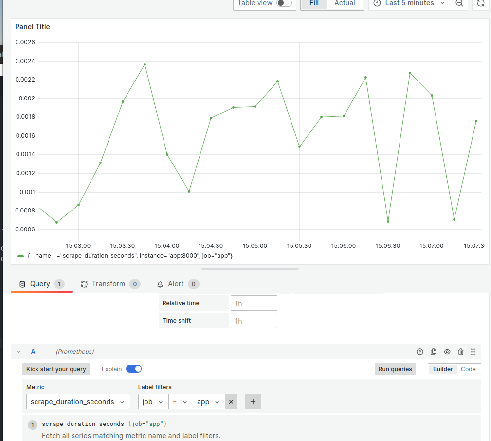
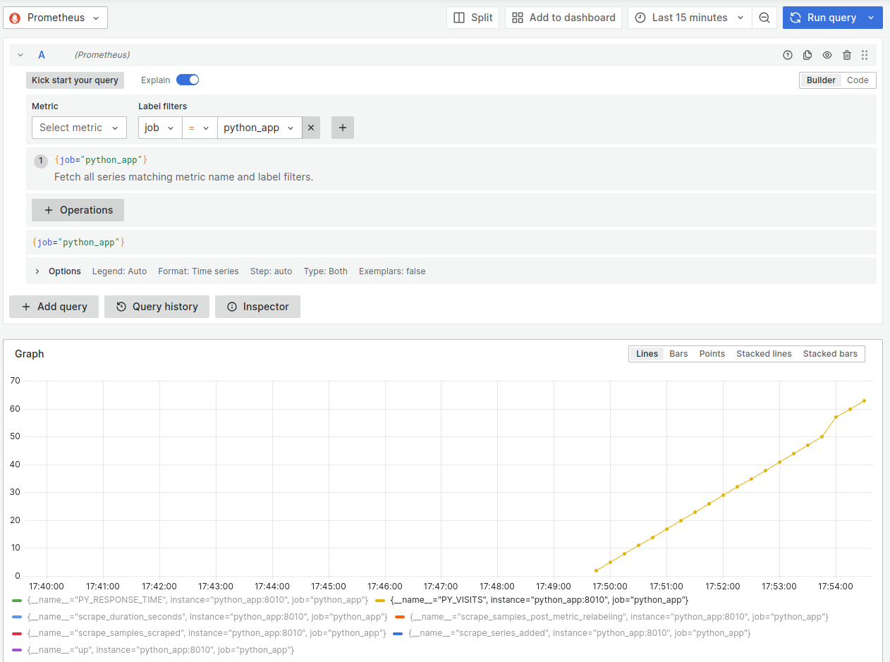
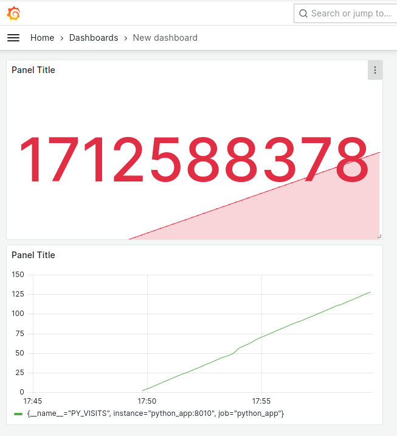
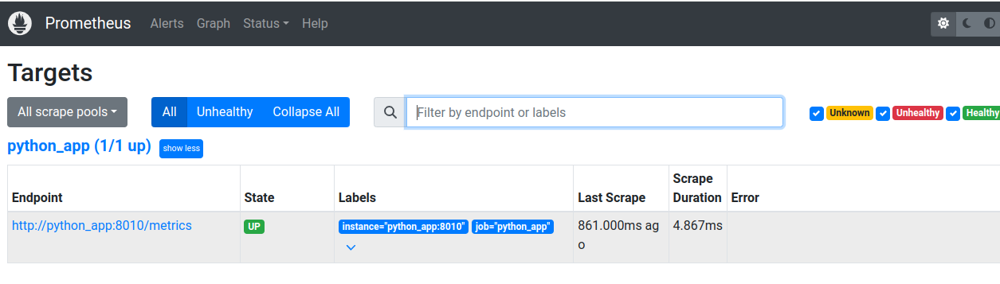

# Prometheus & Grafana

Весь проект, состоящий из Dockerfile, docker-compose.yml и кода приложения на Flask, предназначен для создания и запуска многоконтейнерного приложения с использованием Docker и Docker Compose для мониторинга и визуализации метрик с помощью Prometheus и Grafana.

## PYTHON APP

<http://localhost:8000/metrics>

```txt
# HELP app_response_time Response time of the app in seconds
# TYPE app_response_time gauge
app_response_time 1.7125771202710888e+09
# HELP app_visits Number of visits to /
# TYPE app_visits gauge
app_visits 8.0
```

```bash
docker build -t py_metric_app_alpine:0.0.1 -f Dockerfile.python .
```

```bash
docker run --rm -it -p 8010:8010 py_metric_app_alpine:0.0.1 sh
```

### host

Хост во Flask. По умолчанию Flask запускается на локальном хосте (127.0.0.1), что делает его недоступным извне контейнера Docker.

Вариант 1:

```python
app.run(debug=False, host='0.0.0.0', port=8010)
```

Вариант 2:

```python
import os

# Получаем имя хоста из переменной окружения HOSTNAME
hostname = os.environ.get('HOSTNAME', '0.0.0.0')  # Если HOSTNAME не установлено, используем значение по умолчанию

if __name__ == '__main__':
    app.run(debug=False, host=hostname, port=8010)
```

## GRAFANA

Первая метрика



Получены метрики из python_app





.env.grafana

```txt
ADMIN_USER=admin  
ADMIN_PASSWORD=admin
```

## PROMETHEUS

```bash
curl http://localhost:9090/metrics
```

```yaml
      - '--storage.tsdb.path=/prometheus'
      - '--web.console.libraries=/etc/prometheus/console_libraries'
      - '--web.console.templates=/etc/prometheus/consoles'
      - '--storage.tsdb.retention.time=200h'
      - '--web.enable-lifecycle'
```

```yaml
  evaluation_interval: 15s
  
    metrics_path: /metrics
    scheme: http
```


